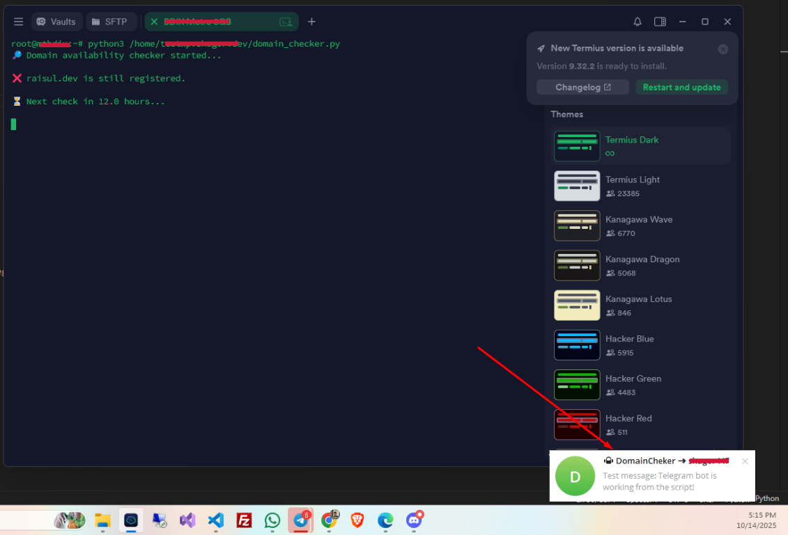

# ⚙️ Domain Availability Checker - With Telegram Alert

A simple Python script that monitors domain availability and sends instant Telegram notifications when a domain becomes available. Designed to run on CyberPanel VPS or any server with Python 3.
---

## 🚀 Features
- Monitors one or multiple domains for availability.
- Sends instant Telegram notifications via Bot API.
- Configurable check interval (default: every 12 hours).
- Logs domain status to console for monitoring.
- Supports running as a cron job or background process.
- Works on any server or VPS with Python 3 and internet access.
- Used api `api.domainsdb.info`.

## 📌 Requirements
- Python 3.10+ 
- requests library
- Telegram bot token and chat ID

## 🖼️ Screenshots
1. ssh result. 

---

## 🚀 Script Installation
Follow these four steps to install and configure the script on your server.

### 1️⃣ Setup Telegram Bot

Follow these steps to configure your bot:

1.  **Get Bot Token:** Open Telegram → Search **`@BotFather`** → Use the `/newbot` command → Secure your **`BOT_TOKEN`**.
2.  **Start the Bot:** Search for your newly created bot → Click **Start** in the chat window.
3.  **Get Chat ID:** Search **`@userinfobot`** → Use the `/start` command → Note down your **Numeric Chat ID**.

### 2️⃣ Upload Script to VPS

Download `domain_checker.py` and upload your script to a designated folder on your server e.g Cyberpanel Directory.

* Assume you upload the script to this path:
    ```
    /home/yourdomain/domain_checker.py
    ```

### 3️⃣ Virtual Environment Setup (Recommended)

Create a virtual environment to isolate your script's necessary packages.

1.  Go to your script folder:
    ```sh
    cd /home/yourdomain
    ```
2.  Create the virtual environment:
    ```sh
    python3 -m venv venv
    ```
3.  Activate the environment:
    ```sh
    source venv/bin/activate
    ```
4.  Install required packages:
    ```sh
    pip install requests
    ```
5.  Test the installation:
    ```sh
    pip list
    ```

### 4️⃣ Run Script Manually

With the virtual environment active, run the script manually to test its functionality:

```sh
python domain_checker.py
```
or use SSH command directly:

```sh
python3 /home/yourdomain/domain_checker.py
```

---

## 🔥 Run Script Automatically with Cron Job

Follow these steps to set up a **Cron Job** to run your Python script automatically.

### Prerequisites
**Connect via SSH:** Open your server's terminal and connect using SSH.
    ```sh
    ssh root@your-server-ip
    ```
    *(Ensure your script, e.g., `domain_checker.py`, is uploaded to the correct path, such as `/home/yourdomain/`)*

### Setup Instructions

1.  **Test the Script:** Before setting up the cron job, run the script manually to ensure it executes correctly.
    ```sh
    python3 /home/yourdomain/domain_checker.py
    ```
    *Expected Output:*
    ```
    🔎 Domain availability checker started...
    ❌ raisul.dev is still registered.
    ⏳ Next check in 12.0 hours...
    ```

2.  **Open Crontab Editor:** Use the following command to open the crontab file for editing.
    ```sh
    crontab -e
    ```
    *(Choose `nano` if prompted for an editor.)*

3.  **Add the Cron Job:** Paste the following line at the end of the file. This command schedules the script and redirects all output/errors to a log file.
    ```crontab
    0 */12 * * * /usr/bin/python3 /home/yourdomain/domain_checker.py >> /home/yourdomain/domain_checker.log 2>&1
    ```

4.  **Save and Exit:**
    * Press **CTRL + O** (Write Out)
    * Press **Enter** (Confirm filename)
    * Press **CTRL + X** (Exit)

5.  **Verify Cron Job:** List the currently installed cron jobs to confirm your new job is listed.
    ```sh
    crontab -l
    ```

---

### 📝 Cron Job Explanation

| Part | Meaning |
| :--- | :--- |
| `0 */12 * * *` | **Schedule:** Run at minute `0` of the hour, every `12` hours. |
| `/usr/bin/python3` | **Executor:** Full absolute path to the Python 3 interpreter on your server. |
| `/home/yourdomain/domain_checker.py` | **Script Path:** Full absolute path to your executable script. |
| `>> /home/yourdomain/domain_checker.log 2>&1` | **Logging:** Redirect all standard output (`>>`) and errors (`2>&1`) to the specified log file. |

---

## 📌 Notes
- Always keep your bot started in Telegram.
- Telegram messages only send if a domain becomes available.
- The cron job runs automatically — no need to manually start the script every time.

---

## 💡 Contact & Support

This project was developed by:

**Raisul Islam**
-   Website: [shagor.dev](https://shagor.dev)
-   Email: deploy@shagor.dev

---

## 🎁 License & Usage

This tool is a **gift for personal use**. You are free to use, modify, and share this code for any personal and non-commercial purposes. It is a token of goodwill and a demonstration of coding with faith.

***Commercial use is not permitted under this license.***
